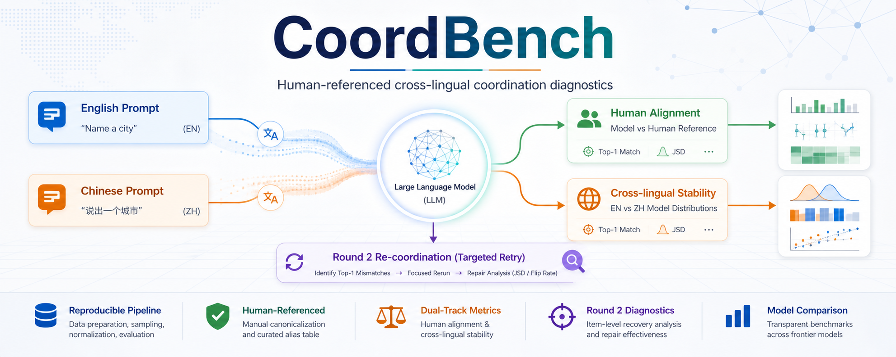
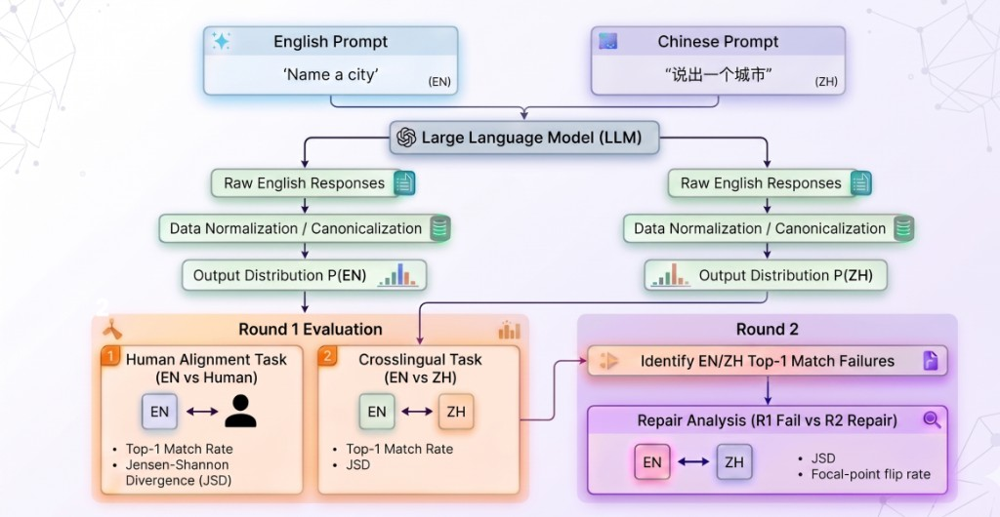
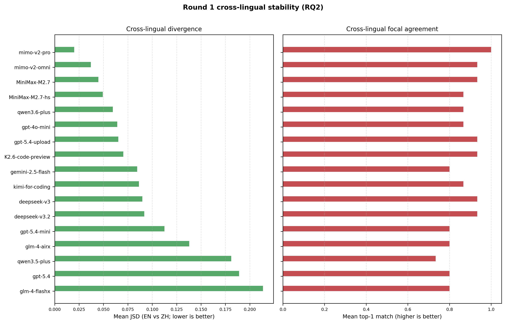

# CoordBench

<p align="center">
  
</p>

<p align="center">
  <a href="https://github.com/CecilyQE/COMP3520_Project"></a>
  
  
  
</p>

CoordBench is a reproducible benchmark pipeline for testing whether large language models preserve tacit coordination behavior across instruction languages. It compares matched English and Chinese prompts while keeping the required answer language fixed to English, then evaluates two separate questions:

- **Human alignment:** do model answer distributions match human focal-point distributions?
- **Cross-lingual stability:** does the same model keep the same focal-point distribution when only the prompt language changes?

The project uses human coordination items from Perez-Zapata et al.'s public OSF materials and packages the full workflow: data preparation, bilingual prompting, model sampling, answer normalization, metric computation, plotting, and Round 2 retry diagnostics.

## Final Report Takeaways

The finalized analysis evaluates **17 Round 1 model runs** on the `study2_british_within` panel with **15 items x 2 prompt languages x 50 samples** per model run.

- **No single model wins both axes.** `mimo-v2-pro` is the most cross-lingually stable model, while `gemini-2.5-flash` is closest to the human reference distribution.
- **Human-likeness and stability are different capabilities.** A model can be stable across English/Chinese prompts while still being far from human focal points, or human-like under one prompt language while drifting under the other.
- **Round 2 helps, but unevenly.** On flagged mismatch items, Round 2 restores top-1 agreement for **14/31** item-model pairs and lowers JSD for **21/31**, with strong model-family differences.
- **The corrected `mimo-v2-pro` cross-lingual JSD is `0.020`, not `0.20`.** The README follows the final report figures, not earlier hand-edited presentation drafts.

## Method Overview

<p align="center">
  
</p>

CoordBench runs the same coordination items under English and Chinese instructions. Both conditions require English answers, so the comparison targets instruction-language effects rather than output-language effects. Raw generations are normalized into canonical answers before building distributions and computing metrics.

The evaluation keeps two metric tracks separate:

- **Human-vs-model alignment:** model distribution vs. human reference distribution.
- **EN-vs-ZH stability:** English-prompt model distribution vs. Chinese-prompt model distribution.

Round 2 is only triggered for items where Round 1 shows a cross-lingual top-1 mismatch.

## Results

### Round 1 Cross-Lingual Stability

<p align="center">
  
</p>

Lower JSD means the English- and Chinese-prompt answer distributions are closer. Higher top-1 match means both prompt languages select the same most frequent canonical answer. `mimo-v2-pro`, `mimo-v2-omni`, and the MiniMax M2.7 family sit in the most stable tier; `qwen3.5-plus`, `gpt-5.4`, and `glm-4-flashx` show much larger drift.

### Round 1 Human Alignment

<p align="center">
  
</p>

Human-alignment JSD compares model output distributions with the same British-within human reference distribution. `gemini-2.5-flash` is closest to humans in both prompt conditions, while several stable models are only mid-pack on human alignment.

### Round 2 Recovery

<p align="center">
  
</p>

<p align="center">
  
</p>

Round 2 is a lightweight retry on each model's own flagged mismatch items. It often reduces distributional drift, but it does not reliably restore the same top answer for every model family.

## Installation

CoordBench requires Python 3.11 or newer.

```bash
pip install -e .[dev]
```

Create a local `.env` from `.env.example` and set the provider keys/models you want to run:

```bash
OPENAI_API_KEY=...
OPENAI_MODEL=...
GEMINI_API_KEY=...
GEMINI_MODEL=...
DEEPSEEK_API_KEY=...
DEEPSEEK_MODEL=...
ANTHROPIC_AUTH_TOKEN=...
ANTHROPIC_BASE_URL=...
ANTHROPIC_MODEL=...
```

Only enabled providers in the selected YAML config are used.

## Quick Start

Run the default English/Chinese benchmark configuration:

```bash
coordbench run-all --config configs/study2_british_en_zh.yaml
```

The default config uses:

- Panel: `study2_british_within`
- Prompt languages: `en`, `zh`
- Required answer language: `English`
- Round 1 samples: `30` in the default config, with finalized report runs curated at `50`
- Round 2 trigger: `cross_lingual_top1_mismatch`
- Normalization: curated aliases with `allow_unmapped: false`

## CLI Workflow

```bash
coordbench fetch-source-data
coordbench prepare-human-panels
coordbench profile-dataset
coordbench run-sampling --config configs/study2_british_en_zh.yaml
coordbench normalize --config configs/study2_british_en_zh.yaml --run-id <run_id>
coordbench analyze --config configs/study2_british_en_zh.yaml --run-id <run_id>
coordbench plot --config configs/study2_british_en_zh.yaml --run-id <run_id>
coordbench run-all --config configs/study2_british_en_zh.yaml
```

Use `run-all` for the standard end-to-end path, or run each stage separately when auditing sampling, normalization, or metric outputs.

## Output Artifacts

Prepared human-panel data lives under `data/prepared/<snapshot_id>/`:

- `panel_items.csv`: benchmark items, prompt text, panel metadata, and language variants.
- `participant_responses.csv`: cleaned individual human responses.
- `human_distributions.csv`: aggregated human focal-point distributions used as the reference.
- `panel_summary.csv`, `dataset_inventory.json`, `selection_report.md`, `benchmark_manifest.json`: audit and provenance files.

Run outputs live under `artifacts/runs/<run_id>/` or curated mirrors under `results/runs_s50/`:

- `raw_generations.jsonl`: raw model responses.
- `normalized_outputs.csv`: canonicalized answers after alias mapping.
- `item_metrics.csv`: item-level JSD, TVD, top-1 match, flip rate, and Spearman diagnostics.
- `summary_metrics.json`: model-level summaries.
- `round2_candidates.csv`: items selected for Round 2 retry.
- `plots/`: generated figures for analysis.

See `results/README.md` for the result-directory convention.

## Repository Layout

```text
src/coordbench/      Python package and CLI implementation
configs/             Benchmark/provider YAML configs
data/                Source and prepared human-panel data
artifacts/           Raw run outputs, caches, logs, and plots
results/             Curated result mirrors and historical reports
scripts/             Experiment runners and monitoring utilities
tools/               One-off aggregation and plotting helpers
tests/               Unit and integration tests
docs/                Proposal, risk notes, updates, and README assets
```

## Testing

```bash
pytest -q
```

## Source Data

- OSF project: <https://osf.io/fv47d/>
- Human coordination source: Perez-Zapata et al., *Three International Studies on Pure Coordination Games*
